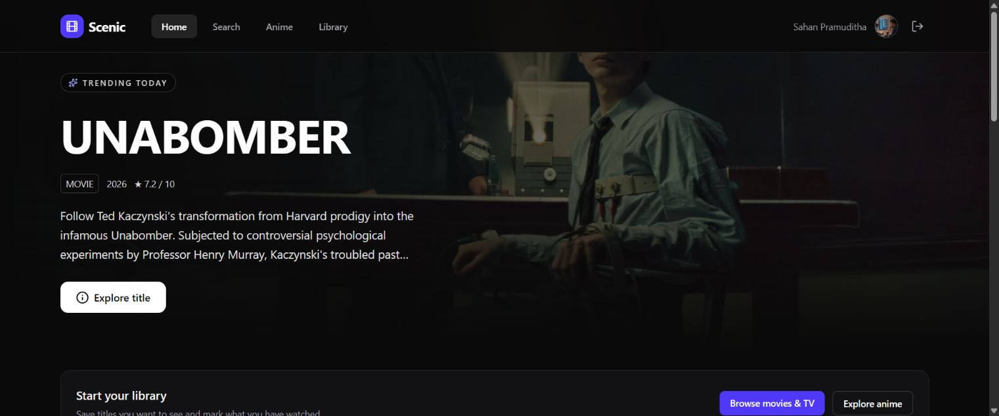
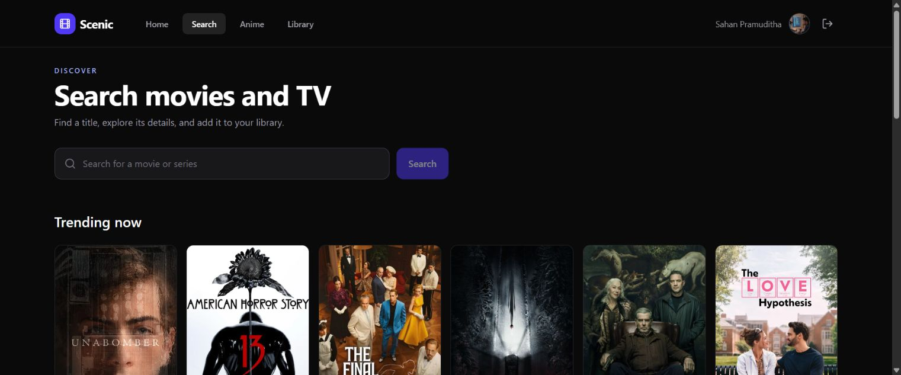
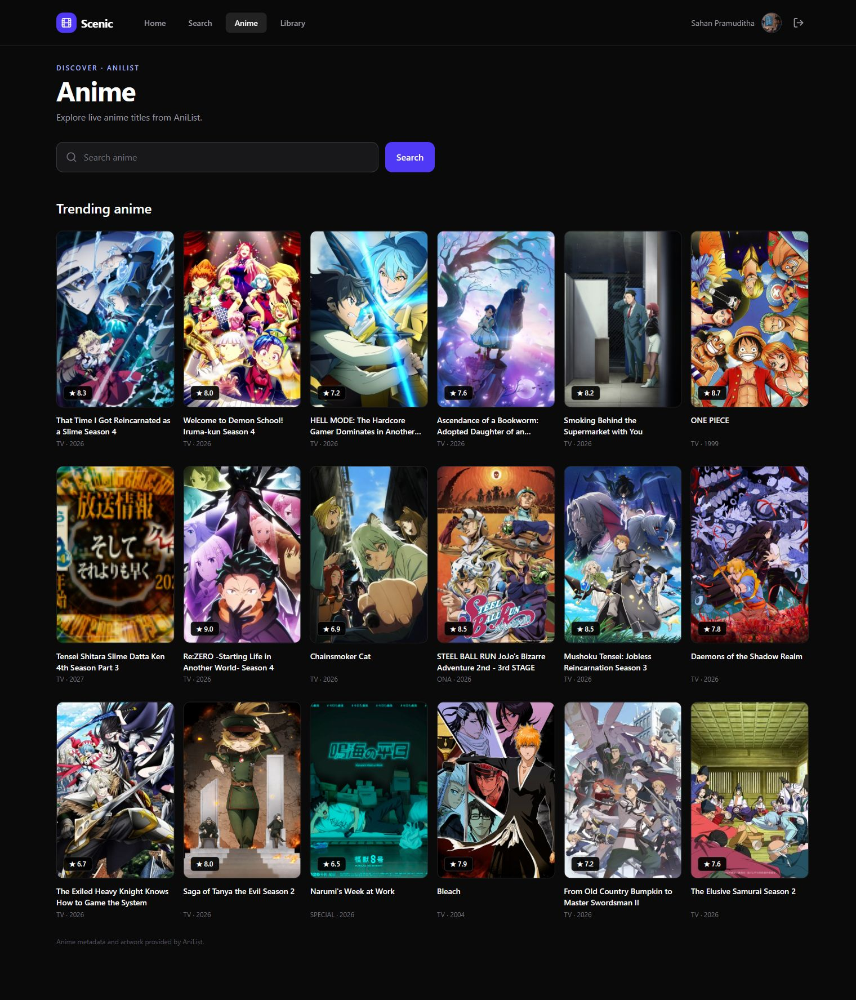
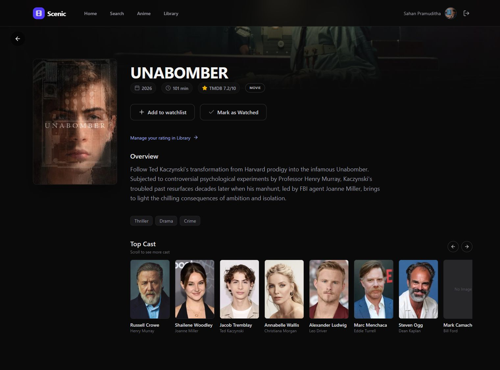
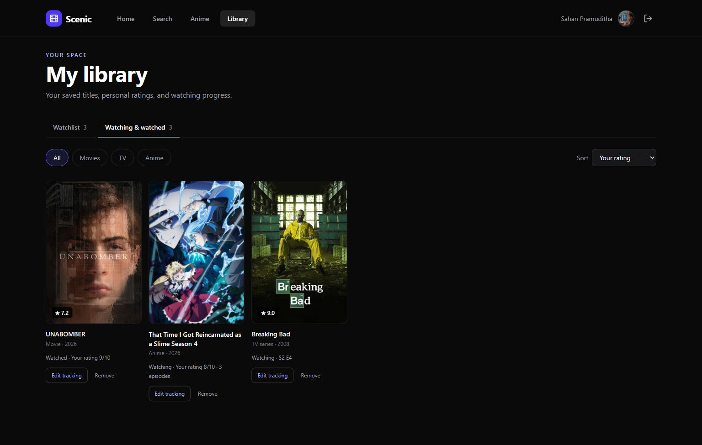

# Scenic

Scenic brings movies, TV series, and anime into one personal entertainment library. Browse live catalogs, save titles, rate what you watch, and record your viewing progress.

## Current features

- Firebase email/password and Google sign-in, with authenticated Node API routes.
- Live TMDB movie/TV trending, search, and detail pages.
- Live AniList anime browsing, search, and detail pages; public catalog reads require no API key.
- A combined watchlist and watching/history library, backed by PostgreSQL.
- Movie / TV / Anime filters, sorting by recency, title, or personal rating, and direct removal.
- Editable personal ratings from 1–10, TV season/episode position, and anime episode counts.
- Responsive navigation, loading/error states, accessible cast scrolling, and save confirmations.
- Versioned database migrations, health/readiness endpoints, structured request logs, and a React recovery screen.

Scenic does not host or stream media. Recommendations, taste analysis, franchise tracking, and advanced statistics remain roadmap work.

## Screenshots

<details>
<summary>View the application gallery</summary>

### Home


### Movies and TV search


### Anime


### Movie details


### Library


### Ratings and episode progress


This view was captured during the signed-in verification workflow. Its temporary movie, TV, and anime tracking entries were removed afterward.

### Sign in and registration


</details>

## Stack

| Area | Technology |
| --- | --- |
| Frontend | React, TypeScript, Vite, Tailwind CSS, TanStack Query, Zustand, Framer Motion |
| Backend | Node.js, Express, TypeScript |
| Persistence | PostgreSQL and Prisma |
| Authentication | Firebase Authentication and Firebase Admin token verification |
| Catalogs | TMDB for movies/TV; AniList GraphQL for anime |

## Local setup

Use **Node.js 24+** and PostgreSQL. Docker Compose provides a local PostgreSQL service on port **5433**.

1. Install dependencies in both directories:

   ```sh
   npm ci
   cd backend
   npm ci
   cd ..
   ```

2. Copy `.env.example` to `.env` and `backend/.env.example` to `backend/.env`.

   - Frontend: fill in the public Firebase app configuration.
   - Backend: set `DATABASE_URL`, `FIREBASE_PROJECT_ID`, and your TMDB v3 API key in `TMDB_ACCESS_TOKEN`.
   - Set `FRONTEND_ORIGIN` to the frontend origin. Locally it defaults to `http://localhost:5173`.
   - AniList catalog browsing needs no credential. Keep backend credentials out of frontend variables and Git.

3. Start PostgreSQL:

   ```sh
   docker compose up -d db
   ```

4. Initialize a **new, empty** database:

   ```sh
   cd backend
   npx prisma generate
   npm run migrate:deploy
   ```

   If your database was previously initialized with `prisma db push`, follow the baseline procedure in [Deployment](docs/DEPLOYMENT.md) before applying migrations. The existing local development database has already been upgraded.

5. Start the API from `backend` with `npm run dev`. In a second terminal, start the frontend from the repository root with `npm run dev`.

Open `http://localhost:5173`; the API listens on port `3000`. Vite proxies `/api` to the Node backend. For a separately hosted backend, set `VITE_API_BASE_URL=https://YOUR-NODE-HOST/api/v1` before the frontend build.

The backend uses Node's system certificate store while keeping HTTPS verification enabled. On Windows, stop a running backend before regenerating Prisma if its engine DLL is locked.

For this workspace's existing isolated PostgreSQL 18 cluster, the local restart command is:

```powershell
& 'C:\Program Files\PostgreSQL\18\bin\pg_ctl.exe' -D 'backend/.local/postgres' -l 'backend/.local/postgres.log' -o '-p 5433' start
```

Cluster files are ignored by Git; this command assumes that cluster already exists.

## Validation

From the repository root:

```sh
npm run build
npm run lint
```

From `backend`:

```sh
npm run build
npm test
npx prisma migrate status
```

The signed-in browser workflow verified movie/anime saves across refresh, rating edits, TV/anime progress, filtering, rating sorting, and removal. Migrations were also verified on a fresh temporary database.

## Deployment and monitoring

See [Deployment instructions](docs/DEPLOYMENT.md) for production variables, migrations, the backend Docker image, frontend hosting, and monitoring configuration. `/api/v1/health` checks the process; `/api/v1/ready` also checks PostgreSQL. Hosting, external alert destinations, and database backups must be configured for the chosen deployment.

## Project documents

- [Project overview](PROJECT.md)
- [Roadmap](PROJECT_PLAN.md)
- [Current phase](PROJECT_PHASE.md)
- [API contracts](API_CONTRACTS.md)
- [UI guidelines](UI_UX_GUIDELINES.md)
- [Database design](DATABASE_SCHEMA.md)
- [Development blueprint](docs/PROJECT_BLUEPRINT.md)

The roadmap and design documents describe the wider planned product; the current-features list above describes the implemented application.
