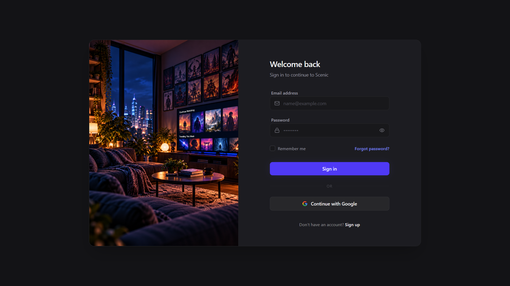
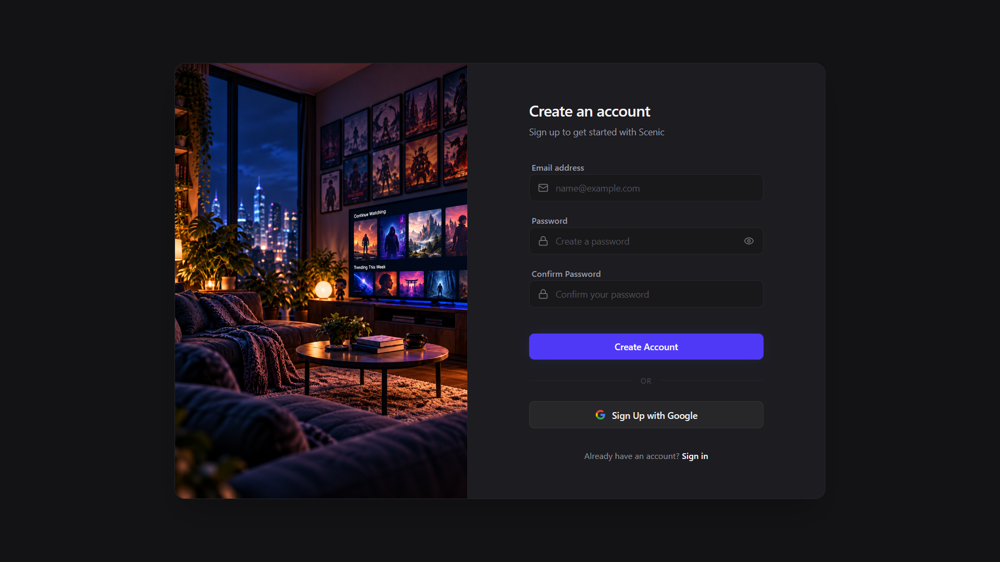
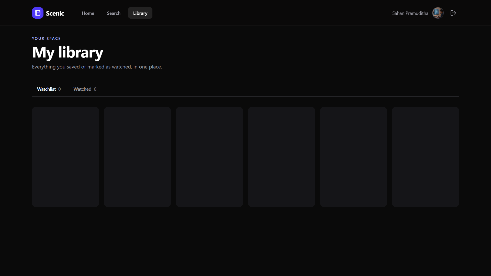

# Scenic

**Scenic is a Personal Entertainment Operating System.** 

More than a generic movie tracker, Scenic is built on the philosophy of **Track → Understand → Decide**. It meticulously records your watch history, builds a deep "Personal Entertainment Graph" from your taste, and uses intelligent decision engines to answer the hardest question in modern streaming: *"What should I watch next?"*

---

## 📸 Gallery

<details>
<summary><b>View Screenshots</b></summary>
<br/>

**Home Dashboard**


**Media Details**


**Trending Grid**


**Authentication**


**Registration**


</details>

---

## The Philosophy

### 1. Track (What have I watched?)
Scenic goes beyond basic watchlists. It tracks complex relationships:
- **Media:** Movies, TV Series, Anime.
- **Granular Progress:** Series completion rates, exact seasons/episodes watched.
- **Franchises & Collections:** Tracks your completion of Universes (e.g., Marvel Cinematic Universe), Franchises (Star Wars), and Directors (Christopher Nolan).
- **Time-based Analytics:** When you watched, rewatch cycles, and longest binges.

### 2. Understand (What do I actually enjoy?)
Raw data is converted into actionable taste signals:
- **Hierarchical Genres:** Understanding you like "Cyberpunk" and "Space Opera", not just generic "Sci-Fi".
- **Studio & Cast Affinity:** Tracking which actors and studios you consistently rate the highest.
- **Backlog Analytics:** Identifying how long items sit in your watchlist and completion rates by genre.

### 3. Decide (What should I watch next?)
The Intelligence Engine powers your night:
- **Decision Wizard:** Filter by Mood, Available Time, and Solo/Group watching.
- **"What Am I Missing?":** Instantly find remaining unwatched titles in a beloved franchise.
- **Smart Queue & Surprise Me:** Intelligent, weighted suggestions rather than pure random selections.

---

## 🛠 Tech Stack & Architecture

- **Frontend:** React, TypeScript, Vite, Tailwind CSS, Framer Motion, Zustand.
- **Backend:** Node.js, Express, TypeScript.
- **Database:** PostgreSQL (via Prisma ORM).
- **Authentication:** Firebase (Email + Google Auth) synced with Postgres JWTs.
- **Catalog Data:** The Movie Database (TMDB) v3 API.

---

## 📚 Project Documentation

For contributors and AI agents working on this project, please refer to the core documentation files in the root directory:
- [`PROJECT.md`](./PROJECT.md) - High-level overview, tech stack, and critical local environment quirks.
- [`PROJECT_PLAN.md`](./PROJECT_PLAN.md) - The master roadmap spanning Phase 0 to Phase 7+.
- [`PROJECT_PHASE.md`](./PROJECT_PHASE.md) - Details on the *current* development sprint and immediate tasks.
- [`API_CONTRACTS.md`](./API_CONTRACTS.md) - REST API documentation and payloads.
- [`UI_UX_GUIDELINES.md`](./UI_UX_GUIDELINES.md) - Scenic's cinematic "Soft Dark" design system.
- [`DATABASE_SCHEMA.md`](./DATABASE_SCHEMA.md) - Postgres schema and the Personal Entertainment Graph data model.

---

## 🚀 Local Setup Instructions

1. **Install Dependencies**
   Run `npm ci` in the repository root, and `npm ci` inside the `backend/` directory.
   
2. **Environment Variables**
   Copy `.env.example` to `.env` (frontend) and `backend/.env.example` to `backend/.env` (backend). 
   - Add your **TMDB v3 API Key** (32-character string).
   - Add your Firebase configuration keys.

3. **Start the Database**
   Start PostgreSQL via Docker. (Note: Scenic maps Postgres to local port `5433` to avoid conflicts with native Windows Postgres instances).
   ```bash
   docker compose up -d db
   ```

4. **Initialize Prisma (Crucial)**
   Always run Prisma commands locally in the backend folder to bypass global v8 conflicts:
   ```bash
   cd backend
   npx prisma generate
   npx prisma db push
   ```

5. **Start the Development Servers**
   In the `backend/` directory, start the API:
   ```bash
   npm run dev
   ```
   In the repository root, start the Vite frontend:
   ```bash
   npm run dev
   ```

*(Note: The backend development script uses `NODE_TLS_REJECT_UNAUTHORIZED=0` to bypass SSL certificate errors common on local Windows environments when connecting to TMDB).*
